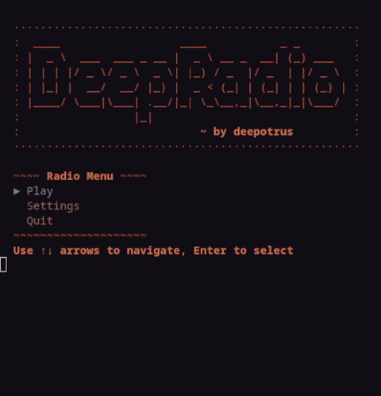

## DeepRadio - Terminal Radio Station
Just my simple minimal terminal radio with my favorite stations to which i can listen to from any system.

It is possible to install preconfigured stations from the TUI, check curl and mpv dependencies and internet connection from the settings menu. In the Play menu there is fun, i.e. the stations you can tune in!
Note that the colors depend on your terminal colors which can be modified with pywal!
```shell
$ ./radio
```
Hope you like!
